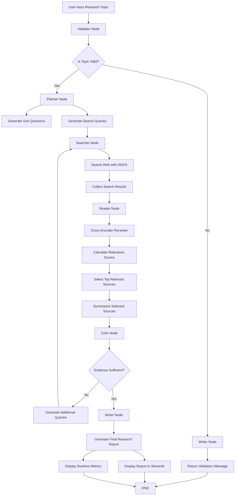

# AI Research Agent with LangGraph and LangSmith

AI Research Agent is a production-oriented research assistant built with LangGraph, LangSmith, Ollama, DDGS Search, and a cross-encoder reranker.

The agent receives a research topic from the user, validates the input, generates research questions, searches web sources, reranks retrieved sources by relevance, summarizes selected sources, checks evidence sufficiency, and produces a structured research report.

## Features

* LangGraph-based agent workflow
* Input validation to block invalid or noisy topics
* Web search using DDGS
* Cross-encoder reranker for source relevance scoring
* Source summarization using local LLM via Ollama
* Critic node with conditional edge and research loop
* Final research report generation
* Runtime research metrics
* LangSmith tracing metadata
* Streamlit user interface
* Markdown report export
* Lightweight CI with GitHub Actions

## Tech Stack

* Python
* LangGraph
* LangChain
* LangSmith
* Ollama
* Streamlit
* DDGS
* Sentence Transformers
* Cross Encoder Reranker
* Pytest
* GitHub Actions

## Agent Workflow



## Runtime Metrics

The app displays runtime metrics from the retrieval and reranking process:

* Total search results
* Selected sources
* Average relevance score
* Maximum relevance score

These metrics are not final-answer accuracy scores. They represent the reranker's estimated relevance between the user topic and retrieved search results.

## Project Structure

```text
ai-research-agent/
├── app.py
├── requirements.txt
├── README.md
├── .env.example
├── src/
│   ├── state.py
│   ├── graph.py
│   └── nodes/
│       ├── validator.py
│       ├── planner.py
│       ├── searcher.py
│       ├── reader.py
│       ├── critic.py
│       └── writer.py
├── tests/
│   ├── test_state.py
│   └── test_graph.py
└── .github/
    └── workflows/
        └── ci.yml
```

## Setup

Create a virtual environment:

```bash
python -m venv .venv
.venv\Scripts\activate
```

Install dependencies:

```bash
pip install -r requirements.txt
```

Pull an Ollama model:

```bash
ollama pull qwen2.5:7b
```

Create a `.env` file:

```env
OLLAMA_MODEL=qwen2.5:7b

LANGSMITH_TRACING=true
LANGSMITH_API_KEY=your_langsmith_api_key
LANGSMITH_PROJECT=ai-research-agent

RERANKER_MODEL=cross-encoder/ms-marco-MiniLM-L-6-v2

MIN_SELECTED_SOURCES=3
MIN_AVG_RELEVANCE=0.70
MAX_ITERATIONS=2
```

Run the app:

```bash
streamlit run app.py
```

## Manual Testing

Example valid topic:

```text
The impact of AI agents on data analyst jobs
```

Example invalid topic:

```text
hahahah wkwk
```

Expected behavior for invalid input:

```text
Validator Node → Writer Node → Validation Message → END
```

The invalid input should not continue to planner, searcher, reader, or critic nodes.

## CI

This project includes lightweight CI using GitHub Actions. The CI checks:

* dependency installation
* state schema initialization
* graph compilation

The CI does not run the full research workflow because the full workflow requires Ollama, web search, and local model execution.

## Current Limitations

* The reader currently summarizes search snippets, not full webpage content.
* The critic node uses rule-based sufficiency checks.
* LangSmith evaluation dataset is not implemented yet.
* PDF export is not implemented yet.
* Deployment is not included yet.

## Future Improvements

* Full webpage content loader
* LangSmith evaluation dataset
* Custom evaluation metrics
* PDF export
* Docker support
* Deployment to Streamlit Cloud, Render, or Hugging Face Spaces
* More advanced LLM-based critic node
